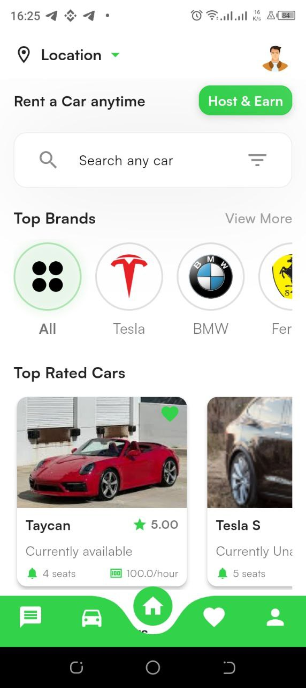
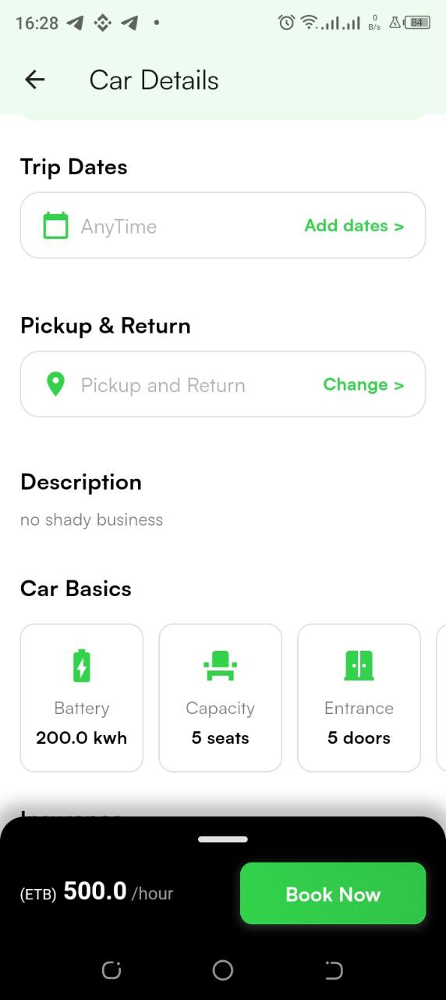
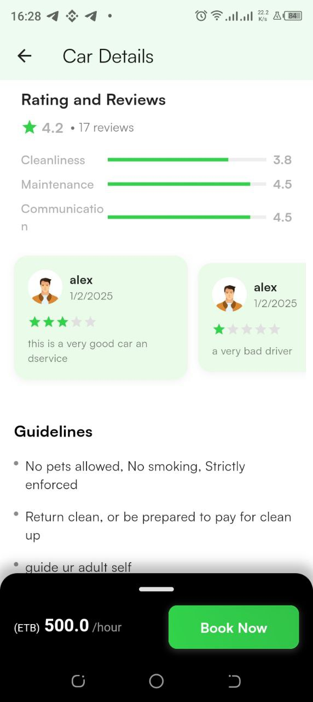
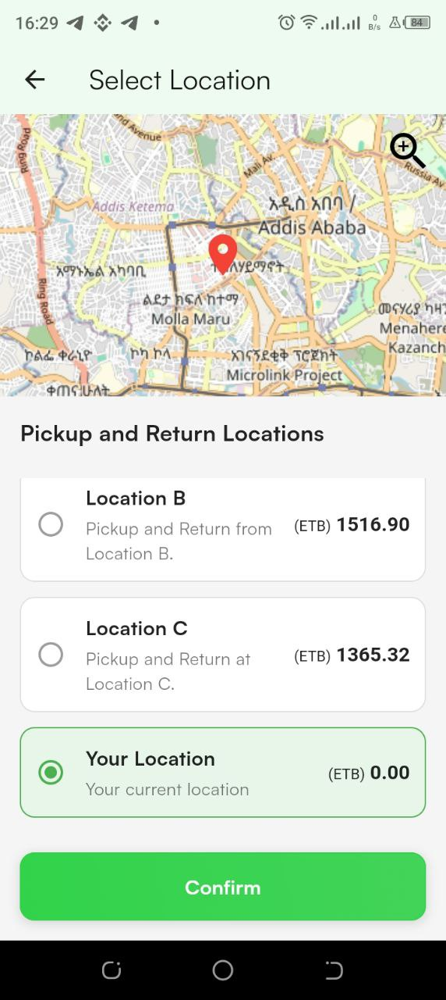
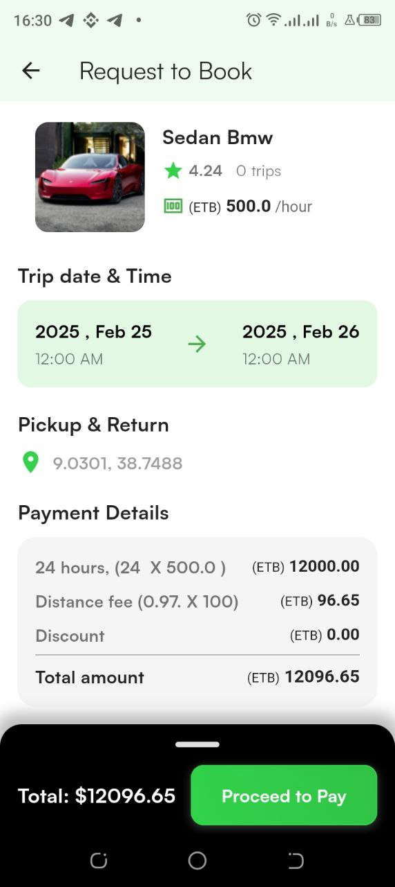
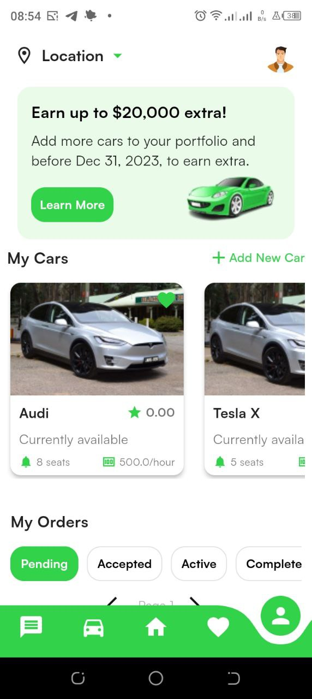
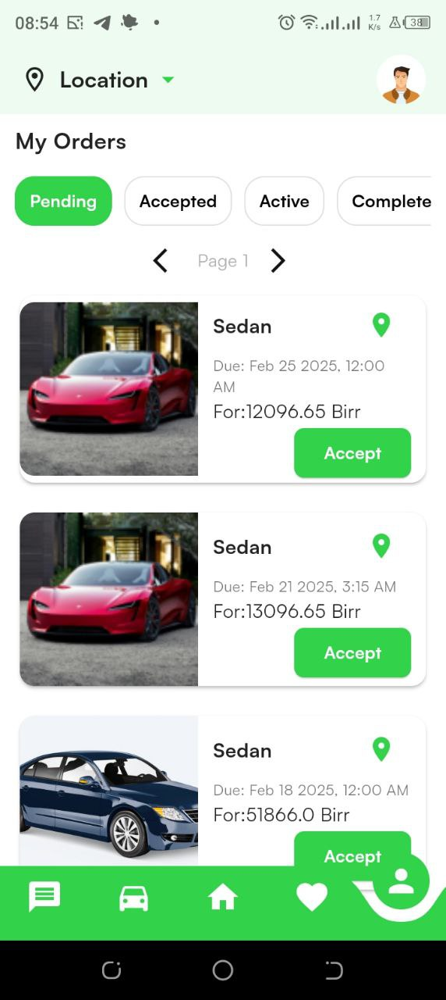

# Auto Rent 🚗

Effortless car rentals, right at your fingertips.

## Overview

Auto Rent is a modern and user-friendly car rental app that provides a seamless experience for customers to browse, book, and manage car rentals. Whether you’re planning a weekend getaway, a business trip, or simply need a car for daily errands, Auto Rent offers a wide range of vehicles to suit your needs.

## Features

### 🔑 Key Features:

- **Browse Cars**: Explore a curated selection of vehicles, from economy to luxury.
- **Smart Filters**: Narrow your search with options for price, type, fuel, and more.
- **Quick Booking**: Rent a car in just a few taps.
- **Location-Based Services**: Find cars available near your current location.
- **24/7 Support**: Always available to assist with your car rental needs.

### 🌟 Why Choose Auto Rent?

- **Flexibility**: Rent by the hour, day, or week.
- **Transparency**: No hidden fees, clear terms, and conditions.
- **Convenience**: Fully digital experience from booking to return.

---

## Getting Started

### Installation

Clone the repository to your local machine:

```bash
git clone https://github.com/TsinatKibru/autorent.git
```

Install dependencies:

```bash
flutter pub get
```

Run the app:

```bash
flutter run
```

---

## Technology Stack

- **Frontend**: Flutter
- **Backend**: Subabase
- **Database**: Subabase/Postgress

---

## App Architecture

Auto Rent follows Clean Architecture principles, ensuring:

- **Maintainability**
- **Reusability**
- **Performance Optimization**

---

## Screenshots

<table>
  <tr>
    <td></td>
    <td></td>
  </tr>
  <tr>
    <td></td>
    <td></td>
    <td></td>
  </tr>
  <tr>
    <td></td>
    <td></td>
   
  </tr>
  <tr>
    <td></td>
    <td></td>
  </tr>
</table>
---

## Contributing

Contributions are welcome! Please follow these steps to contribute:

1. Fork the repository.
2. Create a new branch.
3. Make changes and commit.
4. Submit a pull request.

---
